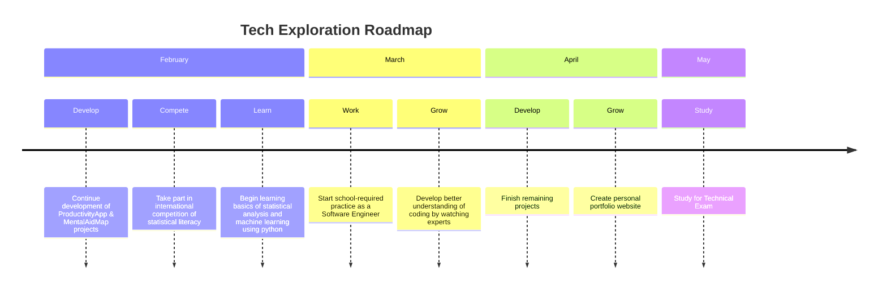
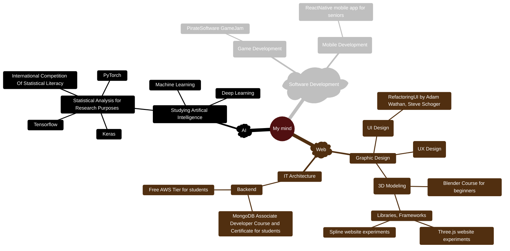

<h1 align="center"> Yo, I'm Panevka!  </h1>

 

## 👀 About me  
 
👨🏻‍💻 Software Developer focused on crafting solutions tailored to complex issues, including social problems

🎓 Student of Software Engineering at renown Technical High School, ranked among the top 30 institutions nationwide

🔎 Always curious, eager to learn new things and explore

🌱 Currently working on [Mental Aid Map](https://github.com/panevka/MentalAidMap), website offering resources to assist individuals experiencing a mental health crisis

📚 In my free time I either play chess, listen to podcasts/online lectures or read literature 
 
 

## 🛠️ Tech Stack:
 

 
 
 
 
 

 
 
 
 
 
 
 

 
 

 
 
 

## 📊 Stats dashboard

 <table>
  <tr>
     <td>
      
    </td>
              </a>
   
<td>
      <a href="https://github.com/panevka">
      
    </td>
  </tr>
</table>

 

<a href="https://leetcode.com/u/panevka/">
 

  
 

</a>

 
 

<!---

## 🚀 Future growth

<h3>🎯 Specific plans and goals</h3>
 
 

<h3>💡 Loose thoughts and ideas</h3>

 

-->
